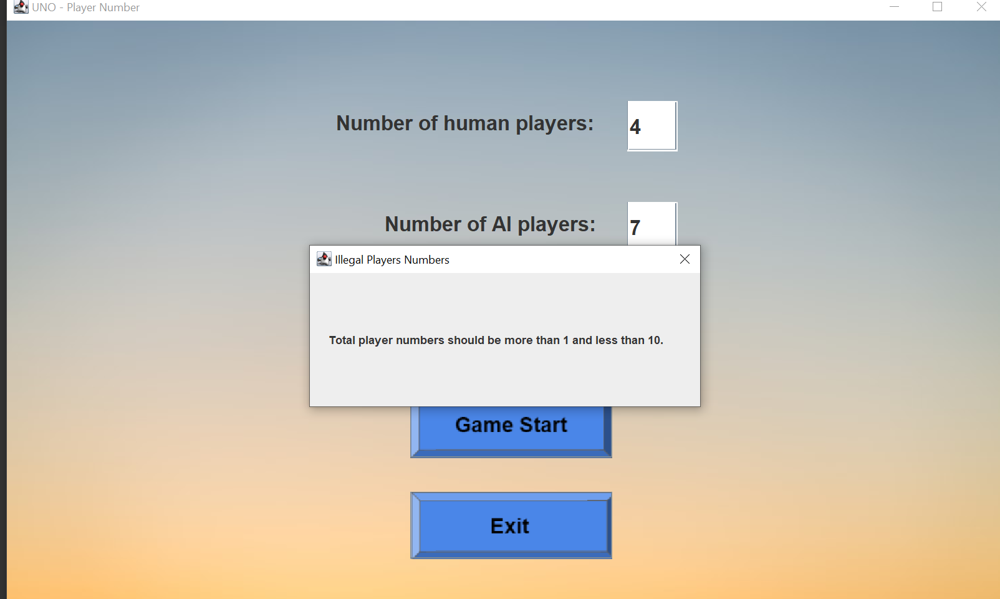
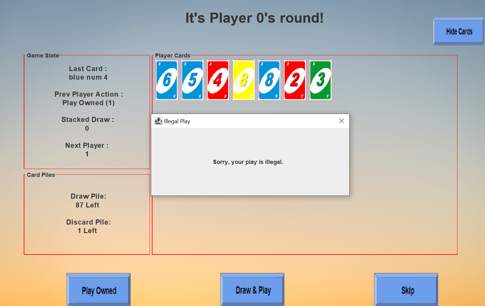

## Manual Test Plan for sp21-CS242-assignment1

### Table of Contents

* [Environment Setup](#Environment)
* [Test-WelcomePage](#Test-WelcomePage)
* [Test-PlayerNumberPage](#Test-PlayerNumberPage)
* [Test-GameStagePage](#Test-GameStagePage)
* [Test-ChooseColorPage](#Test-ChooseColorPage)
* [Test-EndingPage](#Test-EndingPage)
* [Comments](#Comments)

### Environment Setup

- Java JDK - 15.0.2  (swing, awt, lang, util)
- JUnit - 4.13.1
- Junit-jupyter - 5.4.2
- junit-platform - 1.4.2
- IntelliJ - education - 2020.3
- Windows 10

Notice these are only environments where this software got developed and is guaranteed to run. They are not meant to be hard requirements.

### Test-WelcomePage

**@ Test 1.1 - Button "Game Start"**

When user clicks this button, the window should navigate to the [PlayerNumberPage](!PlayerNumberPage).

Test result 1.1: (Successfully navigate to the next page)

**@ Test 1.2 - Button "Exit"**

When user clicks this button, any window should be closed (process exit).

Test result 1.2: Successfully terminate the whole process.

### Test-PlayerNumberPage

**@ Test 2.1 - Illegal Input & Click Start**

The legal value of the input box should be ["2","3","4","5",""6","7","8","9"], nothing else. Any other input should be judged as illegal.

If the user input an illegal string and hit "Game Start", a dialogue should occur (to be implemented in assignment-1.2), and there shouldn't be any nagivations to other pages.

Test 2.1, Case 1: Character inputs - successfully blocked.

Test 2.1, Case 2 : Empty input - successfully blocked.

Test 2.1, Case 3 : Illegal numbers of players - successfully blocked

**@ Test 2.2 - Legal Input & Click Start**

Upon input of a legal number & hitting of "Game Start", the frame should be navigated to [GameStagePage](!GameStagePage).

Test result 2.2 - successfully nagivated to the play stage page.

**@Test 2.3 - Button "Exit"**

Same as Test 1.2.

Test 2.3 result : successfully exit the whole process.

### Test-GameStagePage

**@ Test 3.1 "Show"/"Hide" Button**

- When the cards are shown in the central panel, "Hide Cards" should be on the top right area. Clicking this button should cause all cards in the central panel to be hidden. "Hide Cards" should then be replaced with "Show Cards" in the same position.
- When the cards are not shown in the central panel, "Show Cards" should be on the top right area. Clicking this button should cause all cards in the central panel to be shown. "Show Cards" should then be replaced with "Hide Cards" in the same position.

Hiden Button is clicked (success):

When Show Button is clicked (success):

**@ Test 3.2  Legal"Play Owned"**

- *Test 3.2.1 Colored Number*

  - Previous round should be updated to this card.
  - Discard Pile goes up by 1.
  - Prev player action should be "Play Owned (1)"
  - Next player information should be properly loaded (top prompt, cards panel).
- *Test 3.2.2 Colored Skip*

  - Previous round should be updated to this card.
  - Discard Pile goes up by 1.
  - Next player can only hit "Skip" button. No exception.
  - Prev player action should be "Play Owned (1)"
  - Next player information should be properly loaded (top prompt, cards panel).
- *Test 3.2.3 Colored Reverse*

  - Previous round should be updated to this card.
  - Discard Pile goes up by 1.
  - The next player should be the player who has just finished his turn before this player.
  - Prev player action should be "Play Owned (1)"
  - Next player information should be properly loaded (top prompt, cards panel).
- *Test 3.2.4 Colored Draw2**

  - Previous round should be updated to this card.
  - Discard Pile goes up by 1.
  - Prev player action should be "Play Owned (1)"
  - Stacked Draw should go up by 2.
- *Test 3.2.5 Wild/WildDraw4 *

  - Test 4.1 should be fufilled.
- *Test 3.2.6 User plays two cards*

  - Last Card should be updated to the equivalent card of composition of two chosen cards.
  - Prev player action should be "Play Owned (2)".
  - Discard Pile goes up by **2**.

Test3.2.1 Result (Previous red num 5 is played): Every game state is updated correctly. Other cases such as "green 6", "yellow 3", "blue 0" are all tested.

Test 3.2.2 Result (Previously a "blue skip" card is played) - Player cannot draw&play (else the dialogue as shown below appears), but could only "Skip". All game states are updated correctly as stated above.

Test 3.2.3 Result (Reverse card is played) - Next round is instead Player 3. The game order is reflected to be changed. Discard pile goes up by 1.

Test 3.2.4 Result (Blue Draw 2) - When previous player played a "Draw2". Every game state is properly updated. Player 3 don't have legal cards to play & he cannot choose to click "Draw & Play" button. "Skip" and take the penalty will be his only option. Game states should be updated as stated above.

Test 3.2.5 Result (Wild/WildDraw4):

This functionality needs to be tested together with **Test 4.1**. Please go to that section.

Test 3.2.6 Result (Play two cards by addition / subtraction): All game stated are updated as stated above!

@ **Test 3.3 Illegal "Play owned"**

- A dialogue (to be implemented in assignment-1.2) prompting selected cards is not legal should occur.
- The current GameStagePage should not be updated in any way.

Test 3.3 Result: Attempting to play "red 2", "green 3", "green 2 +/- green 3", "red 4 +/-red 2" should all lead to this dialogue. Choosing 0 or more than 2 cards will also trigger this dialogue. In order scenarios, combining number cards with symbol/wild cards are also not legal. **(Comprehensive Manual Test**)

**@ Test 3.4 Legal"Draw & Play"**

- When the previous player did not played one of "wildDraw4", "draw2", "skip", and current player want to skip his round, he should draw one card and attempt to play it ("Draw&Play").
- If the card is legal, it should be immediately played and program behavior should be same as Test 3.2, except that Prev Player Action should be "Draw & Play (OK)".
- If the card is illegal, the game continues. Sum of Draw & Discard Pile should go down by 1, and Prev Player Action should be "Draw & Play (FAIL)". If the play fails, Last Card should not be updated.

**Corner Case of Draw&Play:** Draw&Play meets Wild/WildDraw4

The pop-up window shows up as expected, and game states are updated correspondingly.

**@ Test 3.5 Illegal  Draw & Play**

1. When the previous player played one of "wildDraw4", "draw2", "skip", and current player don't have corresponding cards to defense the stacked penalty, he should not be able to draw one card and play ("Draw&Play"). The only allowed action will be to "Skip" his turn.
2. If the one the three cards is played, a dialogue as shown below should occur to prevent the click on "Draw & Play" as shown below.

**@ Test 3.6 Legal"Skip"**

"Stacked Draw" should be reset to 0 and the sum of Draw & Discard Pile should go down correspondingly. In the following scenario, the previous player played blue draw2, and player 3 don't have draw2/wildDraw4 to defend, nor could he "Draw & Play". His only option would be to "Skip". When Player 3 skip his round, we can observe that the stacked draw got cleared, the draw pile size goes down by 2.

@ **Test 3.7 Illegal Skip**

1. When the previous player did not play one of "wildDraw4", "draw2", "skip" cards, and current player want to skip his turn, he should be forced to draw a card and attempt to play it. "Skip" button should be an illegal action, and he can only "Draw & Play".
2. A dialogue as shown below should occur to prevent the click on "Skip" when none of the three cards get played.

**@ Test 3.8 Empty Draw Pile meets Draw&Play**

When draw pile is empty, and user request draw & play, the new card should be drawn from discard pile. 

**@ Test 3.9 Draw & Discard Piles are both Empty**

When draw & discard piles are both empty, and player requests to draw a card, it should behave just like the "Skip" button (player won't draw any card).

Suppose there is a "Draw2", "wildDraw4" previously played and there are pending penalty draw, "Skip" button will only force player to draw whatever many cards left in the draw + discard pile. 

### Test-ChooseColorPage

**@ Test 4.1 "Red", "Blue", "Green", "Yellow" Buttons**

To make things simple, red button will be demonstrated for example. When click on this button,

1. this Choose Color Pop-up should close and [GameStagePage](!GameStagePage) should occur.
2. The information on the upper-left panel should be "red sym wild" or "red sym wildDraw4".
3. The [GameStagePage](!GameStagePage) should now be serving on a different player. (Topping prompting should change).
4. The cards demonstrated in the central panel should change.
5. The "Discard Pile" in lower-left panel should go up by 1.
6. Stacked Draw should go up by 4 if the previous play was "red sym wildDraw4".

Test 4.1 Result: Player plays a wild draw 4, the choose color page occurs. When player click the blue button, every thing is correctly updated as stated above. **Manual tests on all other three color buttons have been done, and they all behave as expected.**

**@ Test 4.3 Hitting "X" (close frame)**

Even if the player clicks "X", the whole process should not exit, and this Pop-up window should appear again.

Test 4.3 Result (success): Even if players click "X", the page will **immediately restart**.

**NOTE**: click "X" on all other pages should cause the whole process to exit.

### Test-EndingPage

**@ Test 5.1 "New Game" Button**

- The player ID prompted on top should be correct (player of last round).
- Upon clicking this button, the player should be navigated back to [WelcomePage](!WelcomePage).

Test 5.1 Result : user is nagivated back to the WelcomePage.

